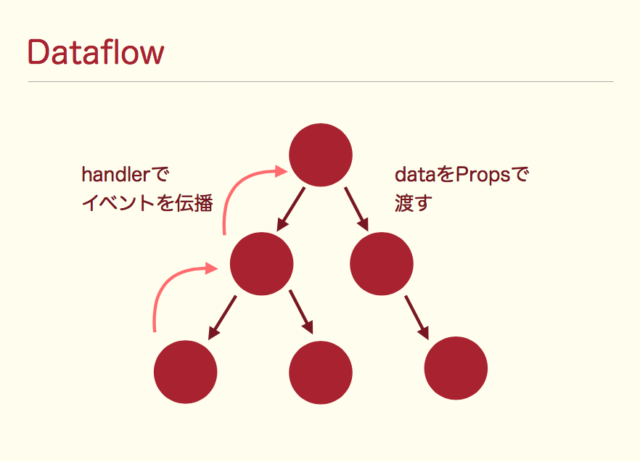

# ReactHookについて
ReactHookはReact 16.8以降に追加された機能です。  
Stateless Functional Componentにstateを後付けで持たせることができる機能です。(Statelessでなくなりますので実質Functional Componentになります。)  
Stateless Functional Componentでstateを後でつけたいという場合はクラスに書き直さずにReactHookを使うと良いです。  

参考：[React 16.8: 正式版となったReact Hooksを今さら総ざらいする](https://qiita.com/uhyo/items/246fb1f30acfeb7699da)
参考：[実践: React Hooks](https://mizchi.hatenablog.com/entry/2019/02/08/154010)

# Functional Componentにstateを付与する（React.useState）
React.useStateを使うとFunctional Componentにstateを付与することができます。  
使い方は`const [stateの値, state更新関数] = React.useState(state初期値)`のように宣言します。  
stateの値の更新をする際はstate更新関数を呼び出しします。  

```Counter.jsx
import React from 'react'

const Counter = () => {
  // const [stateの値, state更新関数] = React.useState(state初期値)
  // stateの値、state更新関数の変数名は必ずしもstate, setStateにする必要はないが、わかりやすさのために今回はこう書いた
  const [state, setState] = React.useState({count: 0})

  return (
    <p>
      <button onClick={() => setState({count: state.count - 1})}>-</button>
      <b>{state.count}</b>
      <button onClick={() => setState({count: state.count + 1})}>+</button>
    </p>
  )
}

export default Counter
```

state更新関数には更新する値を直接セットする方法(非推奨)と、更新関数をセットすることで更新する方法(推奨)があります。  
次の例は、ワンクリックで５回onClick関数を呼び出しするというSuperButtonボタンを作成しています。  
この場合、値による変更の場合、SuperButtonに渡しているstateはMultiCounterがレンダリングされたときのstateのため、挙動がおかしくなります。(MultiCounterの値が更新される前に５回連続で呼ばれるため)  
それに対して、更新関数経由で更新する場合はonClick単位で更新された値が都度、更新関数の引数と渡ってくるため、正しく+5されます。  

```MultiCounter.jsx
import React from 'react'

const SuperButton = ({ onClick, children }) => {
  const onClickFifth = (e => {
    // ワンクリックで５回クリック
    for (const _ of [0, 1, 2, 3, 4]) onClick(e)
  })
  return <button onClick={onClickFifth}>{children}</button>
}

const MultiCounter = () => {
  const [state, setState] = React.useState({count: 0})

  return (
    <div>
      <div>カウント：{state.count}</div>
      {/* 値による変更(非推奨)、連続でレンダリングが走った場合にレンダリングの回数に合わせて、正しくインクリメントされない */}
      {/* SuperButtonに渡しているstateはMultiCounterがレンダリングされたときのstateのため、5回連続で呼び出されてもcountは1だけ増えます */}
      <SuperButton onClick={() => setState({count: state.count + 1})}>値による変更+5（動作しない）</SuperButton>
      {/* 関数形式でパラメータの更新をすることもできる（推奨） */}
      {/* この場合は更新された値が都度引数として渡ってくるため、正常に+5される */}
      <SuperButton onClick={() => setState(state => ({count: state.count + 1}))}>関数形式でのパラメータ変更+5</SuperButton>
    </div>
  )
}

export default MultiCounter
```

Appendix: React.useStateの内部実装はLinkedListで実装されているようです。配列形式で取得するようになっているのはそのためのようです。  
[React HooksのuseStateがどういう原理で実現されてるのかさっぱりわからなかったので調べてみた](https://sbfl.net/blog/2019/02/09/react-hooks-usestate/)

# Functional Componentのレンダリング完了時のライフサイクルメソッドを付与する（React.useEffect）
React.useEffectを使うとFunctional Componentにレンダリングされた後に呼び出されるコールバック関数を付与することができます。  
このコールバックが呼ばれるタイミングは通常のReact.ComponentクラスのライフサイクルメソッドのcomponentDidMount/componentDidUpdateに相当します。  
また、コールバック関数の戻り値にはクリーンアップ関数を指定することもできます。(省略可)  
指定した場合は、次回のコールバック関数が呼ばれる前にクリーンアップ関数がよばれます。クリーンアップ関数はコンポーネントがUnmount時にも呼ばれます。  
第２引数は第１引数のコールバックが呼ばれるための監視対象のstateの値を指定します。  
（レンダリングされる度にコールバックするのではなく、指定のstateの値が更新されたときのみコールバックする）  
ちなみに、空の配列[]を指定すると一度のみコールバックされます。  

```Timer.jsx
import React from 'react'

const Timer = () => {
  const [state, setState] = React.useState({count: 0})

  // レンダリングされた後に第１引数の関数がコールバックされる。パラメータが変更され、再レンダリングされた後でも呼ばれる
  // ライフサイクルメソッドのcomponentDidMount/componentDidUpdateに相当する
  // 第２引数は配列の値が前回と変わったときのみ第１引数の関数をコールバックされる(※空の配列[]を指定すると一度のみコールバックされる)
  // 省略した場合はレンダリングの度に第１引数の関数がコールバックされる
  React.useEffect(() => {
    const timerId = setTimeout(() => {
      setState(state => ({count: state.count + 1}))
    }, 1000)

    // 戻り値にはクリーンアップ関数を指定（省略可）
    // 指定すると次回のコールバックが呼ばれる前にクリーンアップ関数が呼ばれます
    // また、コンポーネントのUnmount時（componentWillUnmount）にもクリーンアップ関数が呼ばれます
    return () => clearTimeout(timerId)
  }, [state])

  return (
    <h1>カウント：{state.count}</h1>
  )
}

export default Timer
```

# ref参照によるDOMの直接制御(React.useRef、React.useLayoutEffect、React.useImperativeHandle)
ref参照経由でのDOMの直接操作はReactのレンダリングフロー制御から外れるため、あまり積極的には使うべきではありませんが、inputタグなどのUncontrolableなDOMに関して使わなければならないときがあったりします。  
React.useRefを使うことでref参照を生成することができます。  
DOMのref属性にてref参照を取得した場合、生のHTMLElementがcurrentプロパティでアクセスすることができます。  
また、React.useLayoutEffectを使うことで、レンダリング結果が描画される前にコールバック処理を行うことができます。  
React.useEffectだとレンダリング結果後にコールバック処理をするため、ref参照のDOMを操作する場合等のレンダリング初回時にちらつきの原因になったりします。  
（React.useLayoutEffectはレンダリングをブロッキングしてしまい、パフォーマンスが良くないため、そういった特殊なちらつきの対策をしたいという場合でない限りは基本的にuseEffectを使うべきです）  
React.useImperativeHandlerはref参照のcurrent配下に独自メソッドを付与するということができます。  
今回の例だと、textareaのフォーカスが外れた際（onBlur）時に`methodRef.current.blur()`を呼び出しています。  

```TextArea.jsx
import React from 'react'

const TextArea = () => {
  // React.useRef(currentプロパティ初期値)でref参照を生成する
  const textareaRef = React.useRef(null)
  // React.useLayoutEffectレンダリング結果が描画される前にコールバックの処理が走る
  // React.useEffectだとレンダリング処理の後に実行されるため、表示が一瞬見えてしまう
  // React.useLayoutEffectはレンダリングをブロッキングするためパフォーマンス的には良くないことに注意
  React.useLayoutEffect(() => {
    // currentにはHTMLElementオブジェクトが入っている
    if (textareaRef.current) {
      textareaRef.current.focus()
      textareaRef.current.value = 'てきすと'
    }
  }, [])

  // React.useImperativeHandleはref参照のcurrentプロパティ配下に対して独自メソッドを付与することができる
  const methodRef = React.useRef()
  React.useImperativeHandle(methodRef, () => ({
    blur() {
      textareaRef.current.value = '変更されました'
    },
  }))

  // ref属性でtextarea DOMのref参照を取得する
  return <textarea ref={textareaRef} onBlur={() => methodRef.current.blur()}/>
}

export default TextArea
```

# アプリケーション内共通データの管理(React.userReducer、React.useContext)
React.useReducerはstateデータをreducerという純粋関数経由で更新することができます。  
実際の更新はdispatch関数経由でreducer関数を呼び出し、stateの値を更新します。  
reducer関数にてstateの値が更新されると再度該当のコンポーネントがレンダリングされます。  
これはアプリケーション内共通データは

 - １つのストアで保存すべき
 - １箇所で更新すべき(reducer)
 - １つの純粋関数経由からのみ更新できる(dispatch)

という思想に基づいています。これらの思想に基づくライブラリにFlux, Redux、MobXがあります。  
  
また、React.Contextという機能を使うことで、子コンポーネント以下は親コンポーネントのパラメータを参照することができます。  
（コンポーネントの親子階層が深い場合、孫ひ孫のコンポーネントまでprops経由でのバケツリレーをしなくて良くなります。）  



子コンポーネント以下にパラメータを渡すには`Context.Provider`のvalueに渡します。  
子コンポーネント以下からパラメータを参照するには`Context.Consumer`から参照するか、React.useContext経由で参照することができます。  
今回の例だと、CounterContext.Providerにstateの値、DispatchContext.Providerにdispatch関数を渡すことで、  
子コンポーネント配下でstateの値、dispatch関数を取得できます。  
（ビジネスロジックとレンダリングの処理を分離している）  

```Increment.jsx
import React from 'react'

const reducer = (initialState = {count: 0}, action) => {
  switch (action.type) {
    case 'increment':
      // stateの値を更新する
      return {
        count: action.count
      }
    default: 
      return initialState
  }
}

// 独自のReact Contextを作成
const CounterContext = React.createContext()
const DispatchContext = React.createContext()

const Increment = () => {
  // const [stateの値, dispatch関数] = React.useReducer(reducer関数, stateの初期値)
  // dispatch関数経由でreducer関数を呼び出し、stateの値を更新します。
  // reducer関数にてstateの値が更新されると再度Incrementコンポーネントがレンダリングされます。
  const [state, dispatch] = React.useReducer(reducer, {count: 0})

  // React.useMemoを使うことで変数をメモ化する
  // 第２引数を[state.count]とすることで再レンダリングの際にstate.countの変更がない場合に変数を再生成せずに使い回す
  const count = React.useMemo(() => state.count + [1, 2, 3, 4, 5].reduce((sum, current) => sum + current, 0), [state.count])
  // const count = state.count + [1, 2, 3, 4, 5].reduce((sum, current) => sum + current, 0) 
  // のように書くこともできるがIncrementがレンダリングされる度にreduce処理がされるためパフォーマンスが下がる

  // React.useCallbackを使うことで関数をメモ化する
  // 第２引数を[state]とすることで再レンダリングの際にstateの変更がない場合に関数を再生成せずに使い回す
  const updateCount = React.useCallback(() => dispatch({type: 'increment', count: state.count + 1}), [state])
  // const updateCount = () => dispatch({type: 'increment', count: state.count + 1}) 
  // のように書くこともできるがIncrementがレンダリングされる度に関数が再生成されるためパフォーマンスが下がる

  return (
    // Context.Providerを使うことで配下のコンポーネントはuseContextもしくはContext.Consumerでパラメータを参照できるようにする
    <CounterContext.Provider value={count}>
      <DispatchContext.Provider value={updateCount}>
        <Preview />
        <div>
          <IncrementButton />
          <span>useContext版</span>
        </div>
        <div>
          <IncrementButtonLegacy />
          <span>Context.Consumer版</span>
        </div>
      </DispatchContext.Provider>
    </CounterContext.Provider>
  )
}

const IncrementButton = () => {
  // Context.Providerで定義したvalueを取得する
  const value = React.useContext(DispatchContext)

  return (
    <button onClick={value}>+</button>
  )
}

const IncrementButtonLegacy = () => {
  return (
    // Context.Consumerを使ったvalueの取得
    <DispatchContext.Consumer>
      {value => (
        <button onClick={value}>+</button>
      )}
    </DispatchContext.Consumer>
  )
}

const Preview = () => {
  const value = React.useContext(CounterContext)

  return (
    <b>{value}</b>
  )
}

export default Increment
```

## コラム：Redux(Flux, MobX)は不要になるのか？
これまではRedux + ReactRedux等を使うことでアプリケーション内共通データ（コンポーネントを横断するデータ）を管理することができました。  
現状以下の２つの課題が解決するまではRedux、ReactReduxは現役ですが、それらの課題がなくなり次第、必要なくなりそうです。
- combineReducer（複数のreducerを１つに統合する機能）
- redux-thunk、redux-sagaミドルウェアに相当する非同期処理
→ React v17で導入予定の非同期処理機能であるReact.Suspense

参考：[React Hooksでredux / react-reduxでやってたことを色々やってみる](https://qiita.com/terrierscript/items/1516e946dfe91397c229)  
参考：[Reactの次期機能のSuspenseが凄くって、非同期処理がどんどん簡単になってた！](https://qiita.com/fumihiko-hidaka/items/c3aaedd073f7bf5a685f)  

何にせよ、今まで3rdパーティ頼みだったアプリケーション内データ管理機能がReact v17では統合されてReact自体で完結する図が見えてきます。  

# メモ化によるパフォーマンス向上(React.useMemo, React.useCallback)
React.useMemoやReact.useCallbackを使うことで変数や関数をレンダリングの度に再生成せずに再利用するため、パフォーマンスが向上します。  
React.useMemoは変数の計算結果を再利用します。主に変数に対してfor文などの高負荷な加工処理が必要な場合に使うとパフォーマンスの向上が見込めます。  
第２引数の該当パラメータが変更されていない場合は計算結果を再利用します。  
React.useCallbackは関数を再利用します。第２引数の該当パラメータが変更されていない場合は関数を再利用します。  
頻繁にレンダリングされるようなコンポーネントの場合、利用したほうがパフォーマンスの向上が見込めます。  

```Increment.jsx
  const [state, dispatch] = React.useReducer(reducer, {count: 0})

  // React.useMemoを使うことで変数をメモ化する
  // 第２引数を[state.count]とすることで再レンダリングの際にstate.countの変更がない場合に変数を再生成せずに使い回す
  const count = React.useMemo(() => state.count + [1, 2, 3, 4, 5].reduce((sum, current) => sum + current, 0), [state.count])
  // const count = state.count + [1, 2, 3, 4, 5].reduce((sum, current) => sum + current, 0) 
  // のように書くこともできるがIncrementがレンダリングされる度にreduce処理がされるためパフォーマンスが下がる

  // React.useCallbackを使うことで関数をメモ化する
  // 第２引数を[state]とすることで再レンダリングの際にstateの変更がない場合に関数を再生成せずに使い回す
  const updateCount = React.useCallback(() => dispatch({type: 'increment', count: state.count + 1}), [state])
  // const updateCount = () => dispatch({type: 'increment', count: state.count + 1}) 
  // のように書くこともできるがIncrementがレンダリングされる度に関数が再生成されるためパフォーマンスが下がる

```

# その他
useDebugValue：カスタムフックのデバッグ用のhookです。ライブラリ開発に使えるかもしれません。ここでは触れません

